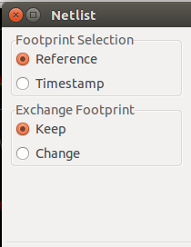

#5. Update linh kiện
Ít lâu sau, bạn thấy mạch của mình cần nâng cấp lên phiên bản mới, với việc thay đổi vài linh kiện trong mạch nguyên lý, tức nhiên làm cả sơ đồ mạch in cũng thay đổi theo. Trong phần này sẽ giúp bạn thực hiện điều đó với vài bước đơn giản như sau.

1. Giả sử bạn muốn thay đổi header CON1 thành CON2

2. Từ KiCad , bắt đầu với [Eeschema](images/icons/eeschema.png), bạn xóa CON1 và thêm CON2. Sau đó bạn chọn footprint tương ứng với CON2 theo yêu cầu mạch mới của bạn.

3. Để chắc chắn, bạn tiến hành lưu lại những thay đổi trên nhanh như cắt với phím tắt [Ctrl + s](annotation.md). Sau đó click vào icon [Netlist generation](images/icons/netlist.png) . Và thực hiện các bước tương tự như ở [Thiết kế nguyên lý](schematics.md) ở bước thứ 31.

4. Tiếp theo chuyển sang mạch in Pcbnew như đã thực hiện ở [Vẽ mạch in](pcb.md) trong mục 4.1.1          

5. Bây giờ chúng ta sẽ tiến hành cập nhật lại footprint bằng cách đọc file Netlist vừa được tạo mới ở bên sơ đồ mạch nguyên lý qua việc click vào icon [Read Netlist](images/icons/netlist.png)  ở trên thanh toolbar ở phía trên của cửa sổ [Pcbnew](images/Pcbnew_window.png). 

6. Tại cửa sổ Netlist, tại mục [Exchange Footprint](images/Netlist_change.png) tích chọn vào ô [Change](images/Netlist_change.png)
    
     

7. Sau đó [Read Current Netlist → YES](annotation.md), rồi đóng cửa sổ Netlist.

8. Lúc này bạn sẽ thấy được các footprint của linh kiện mới đã được cập nhật. Bạn chỉ việc bố chí lại vị trí của footprint mới vào vị trí thích hợp.

9. Các bước tiếp như : đổ đồng, tạo Gerber,... làm tương tự như ở [Vẽ mạch in](pcb.md).

10. Sau tất cả, bạn nhớ là lưu lại những điều đã làm trên lại nhé.

11. Còn những phần thú vị có thể bạn muốn tìm hiểu thêm ở
 - [Tạo thư viện nguyên lý](schematic-library.md)
 - [Tạo thư viện chân PCB](pcb-library.md)
 - [Những lưu ý, mẹo và nguồn tài liệu hữu ích khác](tips-and-tricks.md)
