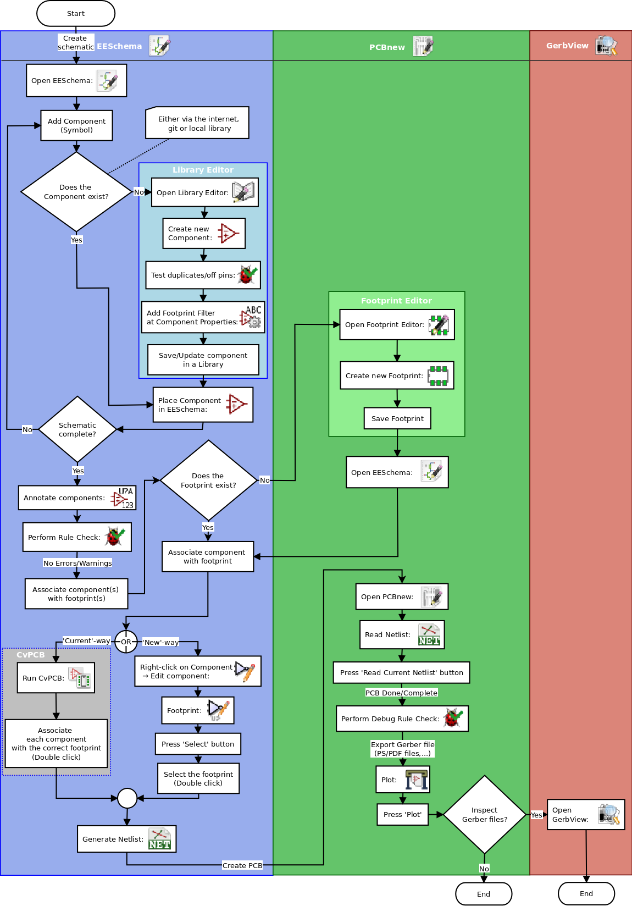

#2. Tiến trình làm việc với KiCad

Mặc dù có sự tương đồng với những phần mềm thiết kế mạch khác, KiCad vẫn có đặc trưng bằng tiến trình công việc có sự phân biệt rõ ràng giữa 2 công cụ thiết kế nguyên lý và mạch in PCB.

##2.1. Tổng quan tiến trình làm việc

Tiến trình làm việc với KiCad chia ra làm 2 phần chính là thiết kế nguyên lý và vẽ mạch in PCB. Cả 2 phần, thư viện nguyên lý và thư viện chân Footprint đều cần thiết cho cả 2 phần.

Trong hình dưới, là mô hình tiến trình làm việc hiện tại với KiCad, giải thích rõ ràng từng bước bạn cần phải thực hiện. Đồng thời các biểu tượng được thêm vào cho dễ dàng thực hiện.

Để có nhiều thông tin hơn về việc tạo thư viện nguyên lý, bạn có thể xem mục: [Tạo thư viện nguyên lý](schematic-library.md). Và phần tạo thư viện chân Footprint linh kiện xem ở mục: [Tạo thư viện chân PCB](pcb-library.md).

##2.2. Đồng bộ giữa mạch nguyên lý và PCB

Một mạch nguyên lý sau khi được vẽ đầy đủ thì bước tiếp theo phải chuyển sang vẽ PCB. Một bản mạch khi một khi muốn hoàn thiện thì trong quá trình vẽ có thể thêm và bớt linh kiện. Điều này có thể thực hiện theo 2 hướng: Tới và Lùi.

Việc đồng bộ Tới là tiến trình chuyển sự thay đổi từ mạch nguyên lý, và làm cho PCB đúng với nó. Điều này là cơ bản vì không ai muốn phải vẽ lại mạch PCB mỗi khi có thay đổi. Có thể xem thêm [Đồng bộ mạch nguyên lý và PCB](annotation.md)
