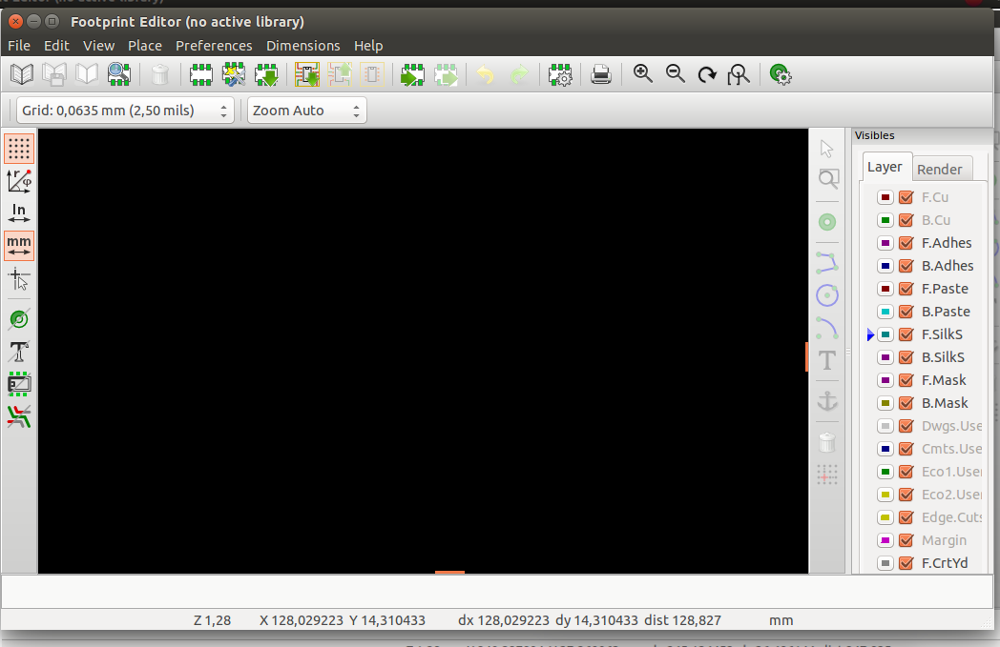
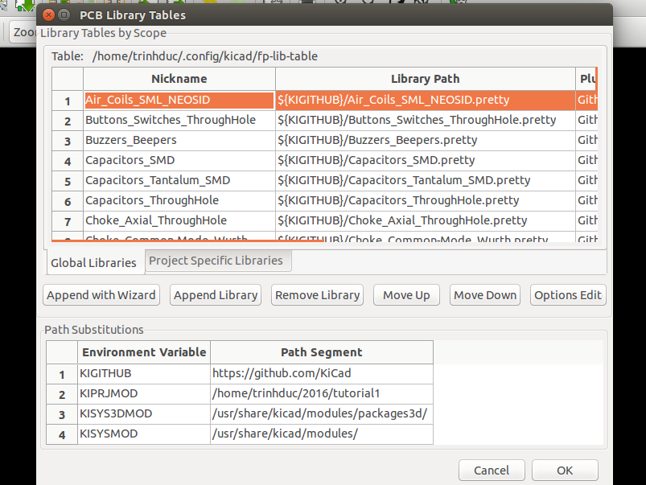

#7. Tạo thư viện chân PCB
Tương tự như trong mạch nguyên lý, thỉnh thoảng bạn cũng sẽ thích tạo ra một thư viện footprint do tự tay mình tao, hay chỉnh sửa một footprint có sẳn. Trong phần này bạn sẽ biết cơ bản để làm những điều trên.

#7.1 Tự tạo footprint

1. Từ cửa sổ Pcbnew, click vào icon Open Footprint Editor  phía trên thanh toolbar. Bạn sẽ mở được cánh cửa bí mật vào thế giới để thiết kế footprint của KiCad.

2. Việc chỉnh lưới làm việc, hay chọn đơn vị [mm](images/icons/unit_mm.png) , [In](images/icons/unit_inch.png) , di chuyển, phóng to nhỏ được thao tác như ở phần vẽ sơ đồ nguyên lý hay sơ đồ mạch in đã làm.
 
3. Trên thanh công cụ phía trên có icon [New Footprint](images/icons/new_footprint.png) , một cửa sổ nhỏ hiện ra để bạn đặt tên cho footprint của mình. Sau khi đặt xong tên, nhấn OK.

4. Nếu bạn muốn lựa chọn các thông số cho Pad linh kiện trước, bạn thực hiện [Dimensions → Pad sitting](images/pad_setting.png). Cửa sổ Pad Properties hiện ra

5. Cửa sổ Pad Properties có các thông số cơ bản thường dùng như :
    - Pad number : số thứ tự của Pad
    - Pad type : nơi chọn lụa kiều Pad
    - Shape : nơi chọn lựa hình dáng Pad
    - Positiong X : vị trí của Pad theo tọa độ X
    - Positiong Y : vị trí của Pad theo tọa độ Y
    - Size X : chiều dài
    - Size Y : chiều rộng
    - Phần Drill : dùng khi Pad type là Through-hole
    - Phần Layer : Lựa chọn các Layer có tác dụng
    
6. Sau khi điều chỉnh các thông số ở trên thích hợp, rồi chọn OK. Ta lấy Pad của linh kiện bằng việc click vào icon [Add Pads](images/icons/pad.png)  ở thanh công cụ bên tay phải. Sau đó di chuyển con trỏ ra phần thiết kế footprint để đặt Pad linh kiện.

7. Để đặt Pad đúng với khoảng cách được mô tả trong datasheet của linh kiện mà không có sai soát, chúng ta nên click đúp vào từng Pad rồi gõ vị trí X, Y tương ứng ở Positiong X, Positiong Y trong cửa sổ [Pad Properties](images/icons/new_footprint.png).

8. Để mô tả rõ hình dáng của linh kiên trong footprint, bạn có thể click vào các icon sau ở thanh công cụ bên phải của cửa sổ Pad Properties
    - [Add graphic line or polygon](images/icons/add_polygon.png)  
    - [Add graphic arc](images/icons/add_arc.png) 
    - [Add graphic circle](images/icons/add_circle.png) 

9. Sao khi vẽ xong đường bao - hay còn gọi là phần thân của linh kiện. Chúng ta sẽ bước qua bước lưu footprint.

10. Trước tiên add footprint mà chúng ta vừa mới tạo vào một nhóm cùng, để sau này chúng ta dễ tìm kiếm hơn. Thực hiện điều đó bằng cái click vào icon [Select active library](images/icons/open_library.png)  ở góc trái phía trên trong công cụ, rồi chọn nhóm footprint cần add.

11. Tiếp theo là lưu footprint lại với icon [Save Footprint in Active Library](images/icons/add_polygon.png)  nằm góc trái của thanh công cụ phía trên (kế bên icon [Select active library](images/icons/open_library.png) ) hoặc đơn giản hơn dùng tổ hợp phím [Ctrl + s]()

12. Và bây giơ chúng ta cần load footprint vừa tạo được lên để có thể lấy dùng ở Pcbnew mỗi lần vẽ mạch. Vào [Preferences → Footprint Library Wizard](pcb-library.md), hợp thoại [Add Footprint Library Wizard](pcb-library.md), tích chọn [Files on my computer → Next → Chọn Folder chứa footprint → Next → Next ](pcb-library.md). Tại bước này sẽ có hợp thoại hỏi bạn muốn chọn dùng footprint đó CHỈ ở dự án đang làm hay là dùng cho TẤT CẢ các dự án. Tích chọn kiểu một trong hai yêu cầu trên và Finish.

13. Bạn cũng có thể cập nhận footprint bất cứ khi nào bạn cần ở giao diện Pcbnew với cách làm tương tự trên.

14. Có thêm footprint vào, tức cũng sẽ có bỏ footprint ra. Bằng việc tích vào [Preferences → Footprint Library Manager](images/PCB_Library_tables.png), cửa sổ nhỏ PCB library Tables xuất hiện

15. Tại tab [Global Libraries](images/PCB_Library_tables.png) sẽ cho bạn biết các thư viện mà có thể dùng ở tất cả các dự án trên KiCad. Còn tab [Project Specific Libraries](images/PCB_Library_tables.png) là nói chứa các thư viện footprint CHỈ dùng riêng cho dự án hiện hành.

16. cửa sổ PCB library Tables này, bạn muốn xóa thư viện footprint nào, bạn chọn thư viện đó và tích vào [Remove Library](images/PCB_Library_tables.png).

17. Hoàn thành tới đây, tức là bạn đã có thể vẽ được mạch với Kicad một cách dễ dàng. Tuy nhiên còn một phần nửa không kém thú vị là
- [Những lưu ý, mẹo và nguồn tài liệu hữu ích khác](tips-and-tricks.md)
