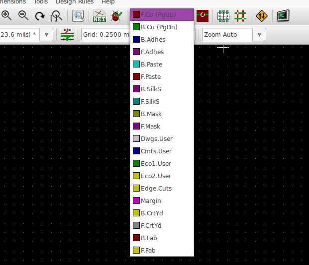
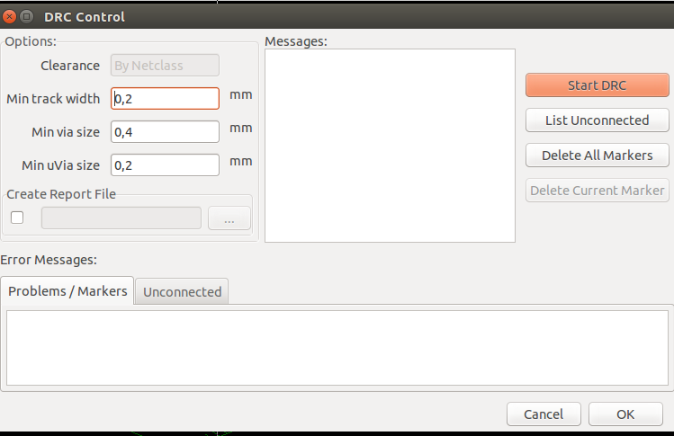
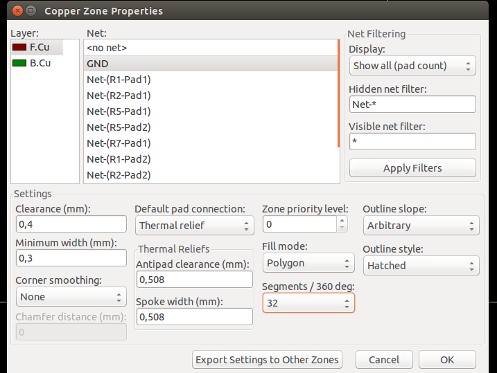
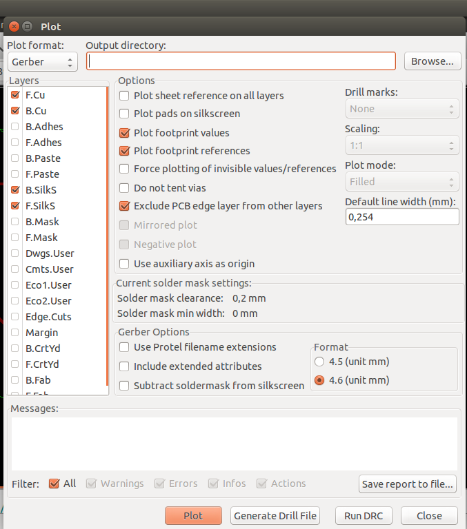
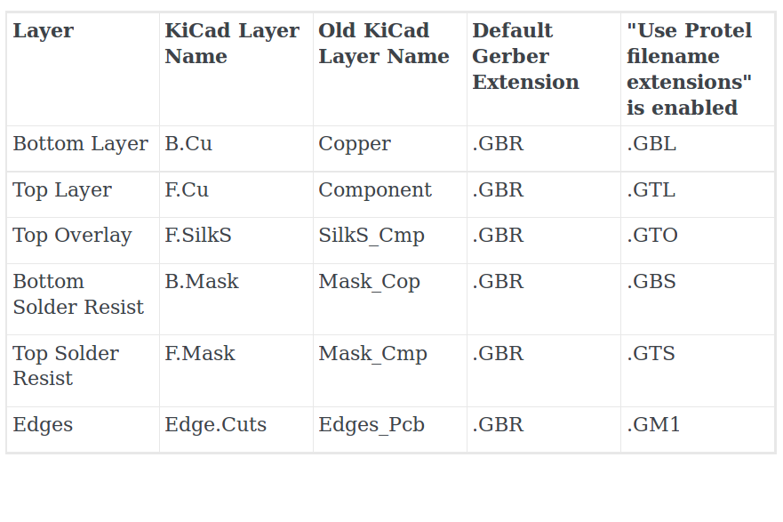

#4. Vẽ mạch in
Phần này chúng ta sẽ biết căn bản về cách tạo một mạch in từ mạch nguyên lý vẽ trước trong KiCad.

##4.1 Pcbnew
1. Ở thanh công cụ chính giữa, phía trên cửa sổ của vẽ mạch nguyên lý, gần góc phải, kích vào biểu tượng [Run Pcbnew....](pcb.md)  để chuyển sang cửa sổ thiết kế mạch in.

2. Bạn có thể chỉnh kích thước của Pcbnew theo ý muốn của mình tại biểu tượng [Page Settings](images/icons/sheetset.png)  ở góc trên phía trái của thanh toolbar. Các thông tin, cách thược hiện tương tự như bạn làm bên vẽ mạch nguyên lý.

3. Để lấy các footprint và kết nối giữa các linh kiện, bạn chỉ việc đọc file netlist đã tạo ở bên vẽ mạch nguyên lý. Hết sức đơn giản, chỉ click vào biểu tương [Netlist](images/icons/netlist.png)  ở giữa thanh thông cụ của [Pcbnew](images/Pcbnew_window.png). Hợp thoại Netlist xuất hiện, click vào [Read Current Netlist](images/icons/netlist.png) → YES. 
Nếu có lỗi về footprint (linh kiện không có footprint, các chân linh kiện không có.... ) cũng sẽ được thông báo ở cửa sổ này, với dòng chữ màu đỏ. Nếu tất cả đều đúng thì bạn đóng của sổ Netlist và chuyển sang bước tiếp theo.

4. Tất cả các footprint của linh kiện sẽ xuất hiện ở phía trên góc trái của cửa sổ Pcbnew.

5. Các thao tác di chuyển, đặt tên, thay đổi lưới, đơn vị và những thao tác được nhắc đến trong thiết kế sơ đồ mạch nguyên lý cũng áp dụng tương tự với Pcbnew.

6. Trước tiên, chúng ta sẽ định hình kích thước - khuôn cho mạch của chúng ta bằng việc chuyển đến lớp [Edge.Cuts](images/select_top_copper.png) như hình sau 

    

7. Sau đó chọn đường để tạo khuôn cho mạch của bạn với 3 biểu tượng có ở thanh công cụ, bên phải như : 
    - Đường thẳng 
    - Vòng cung 
    - Vòng tròn .

8. Tiếp theo bạn sắp xếp các footprint theo ý muốn của bạn vào không gian khuôn mạch mà bạn đã tạo ra.

9. Trong quá trình sắp xếp footprint, nếu bạn thấy các đường kết nối giữa các chân của linh kiện làm rối mắt bạn. Bạn có thể tạm làm ẩn đi các đường đó bằng cách click vào biểu tượng [Hide board ratsnest](images/icons/general_ratsnest.png)  ở thanh công cụ, bên tay trái cửa sổ Pcbnew bạn đang làm việc.

10. Thiết lập một số thông số cho việc đi dây của chúng ta bằng cách click [Design Rules → Design Rules](pcb.md) trên thanh menu.
Điều chỉnh các thông số [Clearance](pcb.md)- khoảng an toàn cho hai đường mạch hay hai chân footprint liền kề nhau, [Track Width](pcb.md)- độ to nhỏ của đường mạch, [Via Dia](pcb.md)- đường kính bảo vệ lỗ khoan, [Via Drill](pcb.md)- đường kính của lỗ khoan.....
Sau khi điều chỉnh các thông số cần thiết theo yêu cầu của đường mạch xong, ta kích OK.

11. Sau khi sắp xếp xong, ta tiến hành đi dây. Click vào biểu tượng [Add tracks and via](images/icons/add_tracks.png)  ở thanh công cụ, bên phải. Hoặc đơn giản hơn bạn trở con chuột đến vị trí cần đi dây và nhấn [phím x](pcb.md).

12. Khi vẽ mạch 2 lớp bạn muốn chuyển đổi giữa lớp trên sang lớp dưới, hoặc ngược lại bằng cách kích chuột phải đường mạch đó và chọn[ Place Via](images/place_a_via.png)

    

    + Hoặc sử dụng [phím v](pcb.md) với có 2 công dụng
        - Chuyển từ lớp trên sang lớp dưới, hoặc ngược lại. NẾU bạn đã hoàn tất xong kết nối của đường mạch đó. Rồi bấm [phím v](pcb.md).
        - Khoang lỗ để chuyển từ lớp trên sang lớp dưới, hoặc ngược lại. Sau khi di chuyển đến vị trí muốn khoang, bạn chỉ việt bấm [phím v](pcb.md).

13. Sau khi đi dây xong, để chắc chắn không còn lỗi nào, chạy [Perform Design Rules Check](images/icons/drc.png) bằng cách kích vào biểu tượng  ở thanh công cụ giữa.

    

14. Thiết lập các thông số cần thiết để kiển trả, theo yêu cầu mạch của bạn. Và kích [Start DRC](pcb.md). Một lát sau, chương trình sẽ thông báo cho bạn biết các cảnh báo, lỗi ở tab [Problems/Markers](pcb.md), các đường mạch chưa nối ở tab [List Unconnected](pcb.md), hoặc chúc mừng bạn đã hoàn thành hoàn hảo việc đi dây.

15. Sau đó tiến hành đổ đông bằng cách kích vào biểu tượng [Add Zones](images/icons/add_zone.png)  ở thanh công cụ, bên tay phải để đổ đồng cho mạch của chúng ta. Hợp thoại xuất hiện 

    

16. Chọn lớp tại [Layer](pcb.md) và kiểu đổ đồng tại [Net](pcb.md) mong muốn rồi nhấn OK.

17. Tiếp theo là bạn thực hiện chọn vùng cần đổ đồng cho mạch. 
    
    NOTE: Điểm đầu và điểm cuối của đường đổ đồng phải trùng nhau.

18. Sau khi hoàn thành chúng ta được mạch

    

19. Thực lưu thành quả của chúng ta đa làm.

20. Và có biết, mạch của chúng ta vừa vẽ xong trông thực tế đẹp như thế nào không ? KiCad cũng hổ trợ, cho phép chúng ta xem trước hình ảnh thực tế của mạch với hình ảnh 3D đẹp vô cùng tổ quốc ta ơi. Với những bước vô cùng đơn giản là [View → 3D View](images/pcbnew_3d_viewer.png)

    

##4.2 Tạo Gerber files
Gerber files để làm gì ? Là những file giúp chúng ta làm mạch thật. Để đi in mạch tự làm hoặc gữi đến các cơ sở làm mạch.

1. Từ [Pcbnew](images/Pcbnew_window.png) kích [File → Plot](pcb.md), xuất hiện hợp thoại

    

2. Chọn định dạng vẽ là Gerber ở [Plot Format](images/gerber_file.png), đường dẫn đến nơi để lưu file Gerber, và chọn các lớp để xuất file Gerber tại [Layer](images/gerber_file.png). Cuối cùng kích vào nut [Plot](images/gerber_file.png) để tạo các file Gerber

3. Nếu bạn vẽ mạch 2 lớp thì bạn cần chọn như bản sau

    

#4.3. Sử dụng GerbView

1. Từ cửa sổ quản lý dự án của KiCad

    

2. Kích vào biểu tượng [GerbView](images/icons/gerbview.png) . Trên thanh menu chọn [Layer 1](images/gerberview_drop_top.png). Click [File → Load Gerber file](images/icons/gerbview.png) hoặc biểu tượng  chọn đường dẫn đã lưu các file Gerber.

3. Để tạo các file chứa các lỗ khoan của chân linh kiện, hay các lỗ khoan mà bạn đã khoan trong quá trình đi dây bằng cách, trở lại cửa sổ [Pcbnew](images/Pcbnew_window.png) từ thanh menu của Pcbnew chọn [File → Plot → Generate Drill File](images/gerberview_drop_top.png), chọn nơi lưu file và chọn các thông số theo yêu cầu của mạch đã vẽ. Và kích vào nút [Drill File](images/gerberview_drop_top.png) để tạo các file Drill.

4. Tiếp theo bạn có thể muốn tìm hiểu thêm
 - [Update linh kiện](annotation.md)
 - [Tạo thư viện nguyên lý](schematic-library.md)
 - [Tạo thư viện chân PCB](pcb-library.md)
 - [Những lưu ý, mẹo và nguồn tài liệu hữu ích khác](tips-and-tricks.md)

