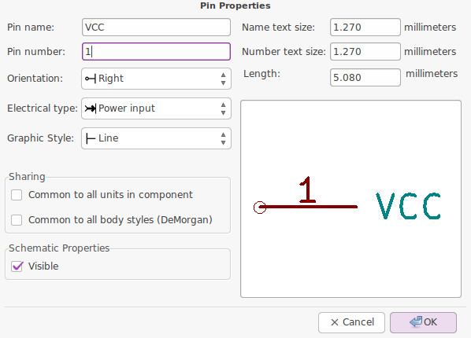
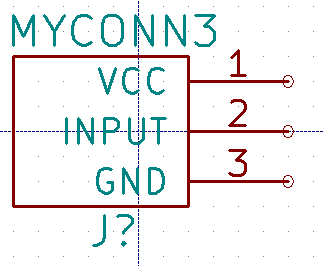

#6. Tạo thư viện nguyên lý trong KiCad
Nếu như, bạn tìm khắp mọi nơi mà không thấy thư viên linh kiện cần dùng hay muốn tạo lại linh kiện theo ý muốn mình, gu sở thích của bản thân thì phải làm sao ? Tất cả sẽ được giải đáp trong phần này.

##6.1 Làm, chỉnh sửa thư viện linh kiện

1.  Chúng ta trở lại của sổ Eeschma. Tại đây, bạn đưa mắt tập chung vào giữa cửa sổ Eeschma, rồi từ từ nhẹ nhàng đưa ánh mắt đi lên, bạn sẽ bắt gặp icon [Library Editor](images/icons/libedit.png) . Click vào icon [Library Editor](images/icons/libedit.png), bạn sẽ được đưa tới một không gian mới mọng mơ, nơi mà bạn sẽ tiếp tục thể hiện năng khiếu vẽ thiên bẩm của mình.

2. Việc chỉnh lưới làm việc, hay chọn đơn vị [mm](images/icons/unit_mm.png) , [In](images/icons/unit_inch.png)  được thao tác như ở phần vẽ sơ đồ nguyên lý hay sơ đồ mạch in.

3. Bạn còn nhớ linh kiện 3 chân, mà chúng ta đã gặp ở [Thiết kế nguyên lý](schematics.md) chứ. Chúng ta sẽ thực hành tạo nó nhé.

4. Để bắt đầu tạo linh kiện mới bạn kích vào icon [New component](images/icons/add_component.pngzoo)  ở thanh công cụ nằng ngang phía trên.

5. Cửa sổ [Component Properties](images/component_properties.png) hiện ra như ở trên. Tao tiến hành đặt tên linh kiện là MYCONN3 ở ô [Component Name](images/component_properties.png), điền J vào [Default reference designator](images/component_properties.png) và [Number of parts per package](images/component_properties.png) là 1. Rồi kích OK

6. Đưa mắt nhìn qua thanh công cụ bên tay phải, và kích vào icon [Add rectangle](images/icons/add_component.pngzoo)  và thực hiện vẽ thân hình cho linh kiện của chúng ta. 

7. Cũng trên thanh công cụ bên tay phải, kích vào icon [Add Pins](images/icons/pin.png)  để tạo các chân cho linh kiện của chúng ta.

8. Sau khi kích vào icon [Add Pins](images/icons/pin.png) , di chuyển chuột ra không gian thiết kế và kích vào đó, hợp thoại Pin Properties hiện lên

9. Đặt tên chân [Pin name](images/pin_properties_vcc.png) là VCC, chân số [Pin Number](images/pin_properties_vcc.png) là 1, và [Electrical type](images/pin_properties_vcc.png) là Passive và OK.

10. Tìm vị trí phù hợp với thân của linh kiện để đặt

11. Làm tương tự với hai chân còn lại của linh kiện
    - Pin name : INPUT, Pin number: 2, Electrical Type: Passive
    - Pin name : GND, Pin number: 3, Electrical Type: Passive

12. Kết quả sẽ trông giống giống thế như sau

13. Lưu linh kiện vừa tạo vào thư viện, bằng cách kích vào icon [New Library](images/icons/new_library.png) . Chọn vị trí lưu thư viện và nhấn SAVE

14. Để có thể nhìn thấy linh kiện vừa tạo ở phần tìm kiến linh kiện trong mạch nguyên lý, bạn cần phải add thư viện vừa tạo vào. Bằng các trên thanh menu chọn Preferences → Component Libraries, nhấn vào ADD để chọn đường dẫn đến nơi chứa thư viện bạn vừa tạo ở cả [User defined search path](images/add_Component_Libraries.png) và [Component library files](images/add_Component_Libraries.png), rồi chọn OK.

15. Cập nhất thư viện vừa tạo bằng việc click vào icon [Update current component in current library](images/icons/save_part_in_mem.png)  ở thanh toolbar phía trên.

16. Cuối cùng lưu tất cả thay đổi với cái click vào icon [Save current loaded library on disk](images/icons/save_library.png) 

##6.2 Chỉnh sửa thư viện
Có những linh kiện tạo sẳn, mà chỉ cần chỉnh sửa đôi chút trên nó là có thể trở thành linh kiện mới mà bạn muốn có. Và cách làm thật đơn giản như sau

1. Cũng trong của sổ , click vào icon [Import component](images/icons/import.png) , chọn đường dẫn đến thư viện mà bạn muốn chỉnh sửa làm thư viện của bạn.

2. Chỉnh sửa thư viện trên thành thư viện theo ý muốn của bạn và thực hiện lưu, add, và update thư viện như làm ở phần 6.1 trên

3. Perfect ! Còn cả các phần rất thú vị như
 - [Tạo thư viện chân PCB](pcb-library.md)
 - [Những lưu ý, mẹo và nguồn tài liệu hữu ích khác](tips-and-tricks.md)
