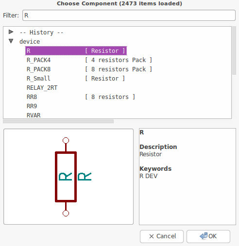
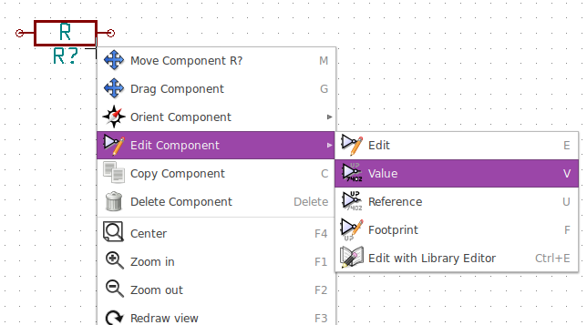

#3. Vẽ sơ đồ mạch
Trong phần này chúng ta sẽ biết cách làm thế nào để vẽ một sơ đồ mạch điện sử dụng KiCad

1. Trên Windown chạy kicad.exe hoặc kích vào icon phần mềm KiCad. Tương tự trên Linux mở Terminal và gõ [kicad](schematics.md) hoặc cũng có thể kích đúp vào icon kicad đã được tạo ở desktop hay thanh công cụ.
Sau khi thực hiện thao tác trên, ta sẽ thấy giao diện KiCad xuất hiện. Từ đâu bạn có thể thấy tám công cụ phần mềm đọc lập của KiCad: Eeschema, Schematic Library Editor, Pcbnew, PCB Footprint Editor, GerbView, Bitmap2Component, PCB Calculator và Pl Editor. Như ở [2.1. Tổng quan tiến trình làm việc](kicad-workflow.md) sẽ cho bạn biết cách sử dụng các công cụ chính để làm việc.
    

2. Để hiểu hơn, bây giờ chúng ta cùng nhau tạo một dự án mới: [File → New Project → New Project](schematics.md). Với trên của dự án là " tutorial1 ", vào bây giờ phần mềm sẽ tự tạo một file dự án với đuôi là ".pro". KiCad sẽ nhắc nhở bạn " bạn có chắc là muốn tạo dự án nguy hiểm này chứ (hjhj...)". Nếu bạn đã sẳn sàng thì phiêu lưu thì chỉ cần kích "YES" để đồng ý. Tất cả các file của dự án của bạn sẽ được lưu tại đây.

3. Việc đầu tiên là ta sẽ đi tạo một nơi mà ta có thể vẽ sơ đồ nguyên lý, và đó chính là  Eeschma.

4. Bạn có thể chỉnh kích thước của Eeschma theo ý muốn của mình tại biểu tượng [Page Settings](images/icons/sheetset.png)  ở đầu của thanh toolbar. Chọn kích thước bạn muốn, đồng thời bạn cũng sẽ thấy có nhiều thông tin khác mà bạn muốn điền vào để mô tả rõ dự án của mình hơn. Rồi kích OK. Cũng tương tự như các phần mềm vẽ mạch khác, để lưu sơ đồ nguyên lý của dự án bạn vào [File → Save Schematic Project](schematics.md) hoặc chỉ đơn giản là [CTRL + S](schematics.md) là xong.

5. Bây giờ chúng ta sẽ đi lấy những linh kiện đầu tiên cho dự án của chúng ta, bằng cách kích vào biểu tượng Place component  ở giữa cửa sổ dự án của chúng ta. Tuy nhiên, có cách nhanh hơn đó là dùng [phím tắt (a)](schematics.md).

    NOTE : còn nhiều phím tắt khác mà bạn có thể dùng bằng cách [Help → List Hotkey](schematics.md)

6. Bây giờ của sổ lựa chọn linh kiện hiện ra, ta [gõ R](schematics.md) để lấy điện trở, linh kiện hiện ra như hình sau
    

7. Kích đúp vào biểu tượng điện trở, sau đó của sổ để lấy linh kiện sẽ ẩn đi, và âm thầm theo dõi bạn làm việc, và nó cũng sẽ sẳn sàng hiện ra ngay lập tức bất cứ khi nào bạn gọi tên nó ( bằng cách gõ "a" ). Bây giờ chị là việc lựa chọn vị trí đắt địa để đặt điện trở.

8. Trong quá trình lựa chọn vị trí đắt địa, bạn muốn nhìn thấy vị trí đẹp trong khuôn khổ của trang, bạn chỉ cần kích vào biểu tượng phóng to  hoặc thu nhỏ . Hiệu quả nhất là bạn dùng con lăn của chuột - nếu có.

9. Nếu bạn muốn xoay điện trở theo hướng khác thì chỉ cần bạn trỏ chuột vào điện trở và [nhấn phím "r"](schematics.md). Muốn di chuyển tới vị trí thoáng mát, đẹp hơn chỉ cần trỏ chuột vào điện trở và [nhấn phím "m"](schematics.md).

10. Như bạn thấy linh kiện điện trở của chúng ta xuất hiện hai chữ là [R?](schematics.md)- [dấu hỏi](schematics.md) ở đây là để biết [linh kiện điện trở thứ mấy](schematics.md) trong mạch, cái này sẽ được tự động làm trong tích tắt với một nút lên có sẳn. 
Chữ thứ hai là [R](schematics.md) để ta chỉnh sửa thành [giá trị của điện trở](schematics.md) bằng cách trỏ chuột vào chữ [R](schematics.md) đó và [nhấn phím "e"](schematics.md) hoặc bạn kích chuột phải vào điện trở và làm theo như hình sau để ghi giá trị của điện trở  
    

11. Cửa sỗ giá trị linh kiện xuất hiện, gõ giá trị linh kiện và kích [OK](schematics.md) ta được như hình sau
    

12. Để lấy thêm linh kiện ta thực hiện lại động tác như đã nói ở trên là [gõ phím "a"](schematics.md). Nhưng lần này bạn sẽ phẻ hơn là không cần gõ tên của điện trở nửa mà chương trình đã tự động nhớ tên linh kiện của bạn đã dùng và chỉ việc chọn lại và sắp đặt linh kiện mà thôi.
    

13. Nếu như bạn muốn xóa linh kiện, chỉ cần chọn linh kiện muốn xóa và [nhấn phím "delete"](schematics.md). Hoặc kích chuột phải vào linh kiện và chọn["Delete Component"](schematics.md)

14. Một câu hỏi đặt ra là, bây giờ trong mạch bạn có tới 20 con điện trợ hay thậm chí nhiều hơn nửa thì bạn cứ nhấn "a" hoài sao ?
Không các bạn ạ, chương trình cho phép ta thực hiện tất cả thao tác " nhấn phím a và chọn linh kiện" bằng cách copy linh kiện ấy không tới một nốt nhạc bằng cách [chọn linh kiên cần copy và nhấn phím "c"](schematics.md)

15. Đôi khi các chân của linh kiện được thiết kế ở các lưới khác nhau - khoảng cách các chân, và bạn muốn thay đổi lưới làm việc cho phù hợp bằng cách kích chuột phải vào không gian đang làm việc và chọn [Grid select](schematics.md) phù hợp. Để hiện/ẩn lưới  làm việc cũng như lựa chọn đơn vị là [mm](images/icons/unit_mm.png)  hoặc [In](images/icons/unit_inch.png)  bạn chỉ cần kích vào các biểu được đó ở thanh công cụ phía bên trái của trang đang làm việc.

16. Trong quá trình tìm linh kiện để làm mạch, nhưng thư viện của KiCad không có và bạn tải thư viện đó về và muốn thêm linh kiện đó vào để sử dụng thì từ menu của cửa sổ Eeschma, chọn [Preferences → Component Libraries](schematics.md) và chọn nút [Add](schematics.md) để dẫn đến file chứa thư viện.

17. Quay trở lại với dự án của chúng ta, bây giờ cũng các tương tự như lấy điện trở, ta lấy LED và PIC12C508A-I/SN, và đặt như sau:
    

18. Ta cần thêm một kết nối 3 chân như sau:
    

19. Nếu không có sẳn bạn có thể tham khảo ở [Tạo thư viện nguyên lý](schematic-library.md) để tạo một linh kiên.

20. Tiếp theo ta các thành phần của nguồn như VCC, VDD, GND bằng cách kích vào biểu tượng  ở thanh công cụ bên tay trái, hoặc bạn cũng có để làm như lấy các linh kiện trước. Và sau đó ta sắp xếp, được như sau:
    

21. Bây giờ ta tiến hành kết nối dây. Kích vào biểu tượng  hoặc dùng phìm tắt [w](schematics.md).

22. Ở các đầu chân của linh kiện sẽ có các vòng tròn, bạn chỉ cần nối các vòng tròn đó giữa các đầu dây mà bạn muốn nối.
    

23. Sau khi nối dây ta được như hình sau:
    

24. Bây giờ ta sẽ kết nối linh kiện với nhau bằng cách dùng labels. Kích vào biểu tượng [Place net name](images/icons/add_line_label.png)  ở thanh công cụ phía tay phải, và chọn vị trí đặt. Sau đó hợp thoại xuất hiện, để ta gõ tên cho label. Như hình sau:
    

25. Như ta thấy hình trên, các chân 2,3,4,5 của PIC không sử dụng. Và nếu ta để trống như thế, khi chạy kiểm tra KiCad sẽ có những cảnh báo. Để tránh những cảnh báo này, ta kích vào biểu tượng [Place no connect flag](images/icons/noconn.png)  ở thanh công cụ phía tay phải và đặt chúng tại chân 2, 3, 4, và 5 của PIC.

    

26. Có thể một vài linh kiện sẽ có những chân bị ẩn đi, và để thấy  những chân đó, bạn kích vào biểu tượng [ Show hidden pins ](images/icons/hidden_pin.png) ở thanh công cụ phía bên tay trái.

27. Vậy nếu bạn muốn viết chú thích hay tâm sự thì phải làm sao ? Ah há, đã có [Lace graphic text ](images/icons/add_text.png) .

28. Bây giờ mạch của ta đã đầy đủ tất cả các linh kiện. Và công việc tiếp theo là bạn phải đánh số thứ tự cho các linh kiện. Bạn có thể làm bằng tay, từng cái một theo ý muốn của bạn, hay sẽ để tự động chương trình làm với [Annotate schematic](images/icons/annotate.png) . Hợp thoại xuất hiện, chọn Use the entire schematic, và kích vào Annotation → OK → Close. Kết quả là các linh kiện đã được đánh số.

29. Bây giờ đê chắc chắn rằng sơ đồ mạch nguyên lý của ta không có lỗi, click vào biểu tượng [Perform electrical rules check](images/icons/erc.png)  trên thanh công tự trên cùng. Chọn [Run](schematics.md), nếu có lỗi chương trình sẽ báo cho bạn những lỗi đó và cũng sẽ tạo các Maskers chỉ cho bạn thấy các vị trí đó trên sơ đồ của bạn.

30. Công việc tiếp theo là add footprint cho các linh kiện. Chọn linh kiện các add footprint và nhấn phím [f](schematics.md), hợp thoại xuất hiện và chọn [Select](schematics.md). Hợp thoại mới, có chứa các footprint của linh kiên - tên, kiểu chân, và mô tả. Sau một hoài tìm kiếm, bạn sẽ tìm thấy được footprint cho linh kiện của mình, một cách dễ dàng. Khi đã thấy footprint cần tìm, bạn chỉ cần nhấn đúp vào tên của footprint đó là xong. Và tương tự cho đến hết.

31. Cuối cùng ta tạo file Netlist, file này giúp chúng ta ghi lại các kết nối chân đã nối, các footprint đã add cho từng linh kiện của ta, và chuyển đổi những điều đó sang mạch PCB.
Click vào biểu tượng [Generate netlist](images/icons/netlist.png)  trên thanh công cụ ở chính giữa của cửa sổ sơ đồ mạch nguyên lý của chúng ta. Một của sổ Netlist xuất hiện chọn [Pcbnew → Generate → Save](schematics.md)

32. Ta chuyển sang [Vẽ mạch in](pcb.md)

