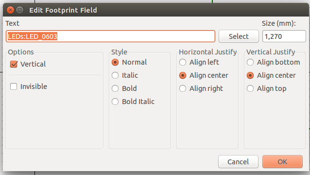

# Những lưu ý, mẹo và nguồn tài liệu hữu ích khác
##1. Mạch nguyên lý
1. Di chuyển linh kiện với dây nối
    -  Khi bạn đã nối dây, giữa các linh kiện với nhau, nhưng bổng nhiên bây giờ bạn thấy cần phải di chuyển một linh kiện trong một khối linh kiện để dễ nhìn hơn. Bình thường bạn sẽ chọn linh kiện và nhấn phím "m" để di chuyển linh kiện đó đên vị trí với, đồng thời bạn xóa đi đường dây cũ đã đi ở vị trí cũ rồi tiến hành đi lại đường nối dây tại vị trị mới.
    Tin vui là bạn không cần phải xóa đường đi dây cũ và đi lại đường dây mới. Phần mềm cho phép bạn di chuyển linh kiện mà vẫn giữ được kết nối đường dây đã đi bằng với phím tắt di chuyển là "g", với điều này bạn cũng có thể di chuyển của đường dây đã nối với linh kiện ấy.

2. Chỉnh sửa/cập nhật giá trị linh kiện
    - Chỉnh sử giá trị của linh kiện đơn giản hơn nhất là bạn chọn linh kiện và nhấn phím "v" hoặc 

3. Add footprint
    - Khi chọn footprint cho các linh kiện của bạn, nếu như có nhiều linh kiện cùng sử dụng chung footprint. Để không lập lại quá trính chọn footprint đó, bạn chỉ cần copy tên của footprint ấy như hình sau
    
 
    Sau đó Past tên footprint đó vào phần tên đường dẫn đến footprint của các linh kiện cùng footprint như hình trên là xong.

##2. Mạch in

1. Một số hotkey thường dùng
	* **Phím x** đi track
	* **Phím c** về chế độ thường
	* **Phím v** khoan via
	* **Phím l** khóa linh kiện, không di chuyển linh kiện được nửa
	* **Phím n** thay đổi kích thước lưới thiết kế (đi từ trên xuống) 

2. KiCad hổ trợ 3 view mode để người dùng có thể đi dây
	* **Switch Canvas to Legacy** - hotkey **F9**
	* **Switch Canvas to OpenGL** - hotkey **F11**
	* **Switch Canvas to Cairo** - hotkey **F12**
Sau khi tìm hiểu, và dùng thì mình thấy view mode **Switch Canvas to Cairo** khá hay, nó giúp mình đi dây được dễ dàng hơn, và đặt biệt việc chỉnh sửa vô cũng thích thú vì nó hổ trợ chỉnh sửa trên một track/via đồng thời nó sẽ tự động chỉnh sửa những track/via xung quanh nếu đường track/via mình đang chỉnh sửa tác động đến các track/via bên cạnh.

3. Việc chọn view mode để đi dây, đồng thời chọn **High contrast display mode** ở phía dưới góc trái hoặc **nhấn phím h** sẽ giúp bạn phát huy tối đa trong việc thiết kế PCB. Vì ở **High contrast display mode** sẽ giúp bạn chỉ nhìn thấy **layer** hiện tại của bạn đang dùng và nó sẽ làm mờ đi các layer còn lại.

4. Thỉnh thoảng vì lý do gì đó mà chuột bạn chạy mất kiểm soát khiến bạn không còn thấy vùng PCB mình đang thiết kế nửa thì bạn dùng   hoặc nhấn phím **home** để quay lại vùng thiêt kế PCB của mình.
